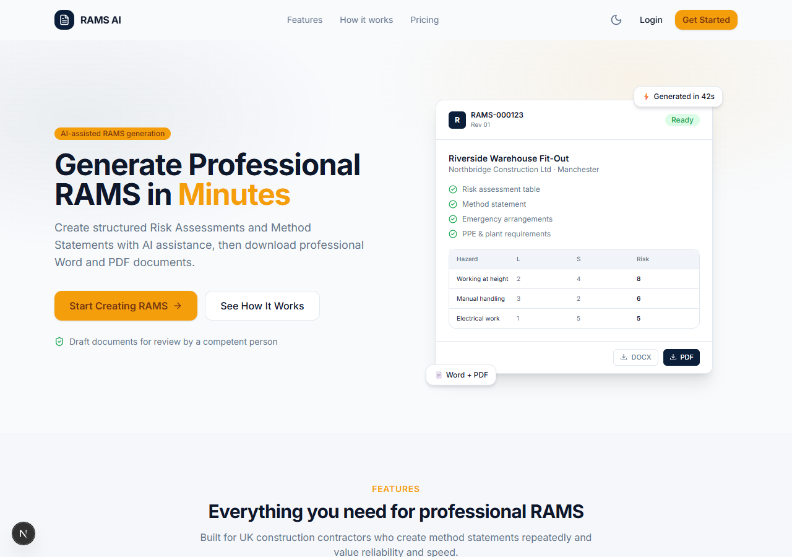
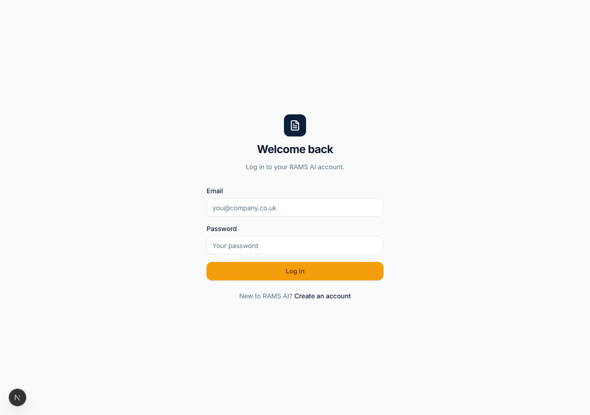

# RAMS AI Demo

A demo B2B SaaS for UK construction contractors: generate professional
Risk Assessments & Method Statements (RAMS) from structured project
information with AI-assisted content, then download production-style Word
and PDF documents.

> **Demo disclaimer** — AI-generated RAMS are **draft documents** and must be
> reviewed and approved by a competent person before use. This is a portfolio
> demo; nothing produced here is legally or professionally certified.

## Demo at a glance

| Step | What happens |
|---|---|
| Register / login | Supabase Auth, protected dashboard |
| Subscribe (1 click, simulated) | Mock payment provider activates a 30-day plan |
| Fill the 4-step wizard | Project → Work → Controls → Review |
| Generate with AI | Structured hazards + method statement (mock provider, Pydantic-validated) |
| Download | Professional **DOCX** (python-docx) + **PDF** (ReportLab), stored in Supabase Storage |

No Stripe account, no OpenRouter key, no Docker required to run the demo.
Real providers plug in via environment variables with zero code changes.

## Features

- Email/password authentication with protected dashboard and middleware guards
- Subscription billing with **server-side entitlement enforcement** (mock provider
  by default; real Stripe code written and switchable via `PAYMENT_PROVIDER`)
- Reusable company profile (details + logo) auto-attached to every document
- 4-step RAMS wizard with client + server validation and duplicate-submit guard
- AI generation with strict Pydantic validation, bounded retries and
  **atomic publishing** (a failed run never produces a partial document)
- DOCX + PDF generation, uploaded to persistent Supabase Storage
- Authenticated downloads via short-lived signed URLs
- Light + dark themes, responsive layout, full loading/empty/error states

## Tech Stack

| Layer | Choice |
|---|---|
| Frontend | Next.js 15 (App Router) + TypeScript + Tailwind v4 + Framer Motion |
| Backend | FastAPI + Pydantic v2 + httpx + pytest |
| Auth / DB / Storage | Supabase (Auth, Postgres + RLS, Storage) |
| Payments | Adapter pattern: `MockProvider` default, `StripeProvider` ready |
| AI | Adapter pattern: `MockAiProvider` default, `OpenRouterProvider` ready |
| Documents | python-docx (DOCX) + ReportLab (PDF, no Docker needed) |
| Infra | Docker Compose files included (backend + Gotenberg optional) |

## Architecture

```text
Next.js (port 3200 dev)
  │  Supabase session (cookies) → JWT access token
  ▼
FastAPI (port 8000)
  ├── Supabase Auth (JWKS)      → verify user per request
  ├── Supabase Postgres         → profiles / subscriptions / rams /
  │                               generation_jobs / stripe_events
  ├── MockAiProvider            → structured content (validated Pydantic)
  │   (OpenRouterProvider ready via AI_PROVIDER=openrouter)
  ├── python-docx / ReportLab   → DOCX + PDF bytes
  ├── Supabase Storage          → rams-documents/{user}/{rams}/rams.{docx,pdf}
  │                               company-assets/{user}/logo.{png,jpg,webp}
  └── MockProvider              → instant subscription activation
      (StripeProvider ready via PAYMENT_PROVIDER=stripe)

Generation pipeline (atomic):
  entitlement → ownership → duplicate guard → job → AI → validate →
  DOCX → PDF → upload both → persist → status=ready
  any failure → status=failed + safe message + orphan cleanup
```

## Project Structure

```text
rams-ai-demo/
├── frontend/            # Next.js: app/, components/, lib/, tests/
├── backend/             # FastAPI: routers/ services/ repositories/
│                        #          schemas/ integrations/ core/ tests/
├── db/migrations/       # 001 schema · 002 RLS · 003 storage
├── docker-compose.yml   # backend + Gotenberg (optional)
├── .env.example
└── README.md
```

## Screenshots




## Demo Video

_TBD — record the 3–5 minute script in "Demo script" below._

## Local Development

Prerequisites: Node 22+, Python 3.11+. No Docker, Stripe or OpenRouter needed.

```bash
# 1. Database — run in Supabase SQL Editor, in order:
db/migrations/001_initial.sql
db/migrations/002_rls.sql
db/migrations/003_storage.sql

# 2. Environment
cp .env.example frontend/.env.local   # fill NEXT_PUBLIC_* keys
cp .env.example backend/.env          # fill SUPABASE_* keys

# 3. Frontend
cd frontend && npm install && npm run dev      # http://localhost:3200

# 4. Backend
cd backend
python -m venv .venv && .venv\Scripts\activate
pip install -r requirements.txt
uvicorn app.main:app --reload                  # http://localhost:8000

# 5. Tests
cd backend && .venv\Scripts\python -m pytest -q
cd frontend && npm run test && npx tsc --noEmit
```

### Switching to real providers

```bash
# backend/.env
PAYMENT_PROVIDER=stripe
STRIPE_SECRET_KEY=sk_test_...
STRIPE_WEBHOOK_SECRET=whsec_...
STRIPE_PRICE_ID=price_...

AI_PROVIDER=openrouter
OPENROUTER_API_KEY=sk-or-...
```

## Database Schema

| Table | Purpose |
|---|---|
| `profiles` | User + reusable company information |
| `subscriptions` | Subscription state, one row per user (upsert sync) |
| `rams` | RAMS records: input, generated content, file paths, status |
| `generation_jobs` | Job tracking + partial unique index (one active job per RAMS) |
| `stripe_events` | Webhook event ids (reserved for the Stripe provider) |

RLS: users access only their own rows. `rams-documents` has zero client
policies — backend service role only, users download via signed URLs.

## Billing (mock mode)

`POST /api/stripe/checkout` activates a 30-day plan instantly.
`POST /api/billing/cancel` ends access. Entitlement (`active`/`trialing`,
configurable `past_due`) is enforced server-side on every generation —
the frontend is never trusted. The real `StripeProvider` (Checkout +
Customer Portal + customer linking) is implemented and covered by the same
entitlement tests; it activates with `PAYMENT_PROVIDER=stripe`.

## AI Generation (mock mode)

`MockAiProvider` builds deterministic, Pydantic-valid output from the form
input (hazards with correct L×S scores, method statement, PPE, emergency,
environmental). `OpenRouterProvider` implements the real flow (strict
`json_schema` response format, 45 s timeout, max 2 attempts, exponential
backoff, `AI_INVALID_RESPONSE` on malformed output). Switch with
`AI_PROVIDER=openrouter`.

## Document Generation

- **DOCX** (`services/document.py`): 12-section professional template —
  cover, document control, project, scope + sequence, responsibilities, PPE,
  plant/equipment, dynamic risk table + per-hazard detail, 3-stage method
  statement, emergency, environmental, sign-off with the mandatory disclaimer.
- **PDF** (`services/pdf.py`): ReportLab mirror of the same data — navy
  headers, repeating risk table, footer with doc number + page numbers.

## Testing

Backend: **43 tests, all passing** · coverage **78%** overall, 85–100% on
all pure logic (routers, services, schemas).

```text
pytest -q                                    # 43 passed
pytest -q --cov=app --cov-report=term-missing
```

| Suite | Covers |
|---|---|
| `test_e2e_flow.py` | Full journey: subscribe → create → generate → download → second RAMS → cancel → blocked → delete + cleanup; plus no-subscription sad path |
| `test_generation.py` | Risk matrix, mock validation, 403 without subscription, 404, 409 duplicate, failed-run safety |
| `test_billing.py` | Entitlement matrix, idempotent checkout, cancel removes access |
| `test_rams.py` | Validation, CRUD, cross-user isolation (404s) |
| `test_documents.py` / `test_pdf.py` | Valid files, content assertions, endpoint guards |
| `test_storage.py` | Signed URLs, logo MIME/size guards, path convention |
| `test_security.py` | Rate limit 429, startup env validation |
| `test_health.py` | Health + auth rejection |

Frontend: `npm run test` (vitest smoke) + `npx tsc --noEmit` clean.
Lower-coverage areas are exactly the code paths requiring live external
services (Supabase REST rows, Stripe/OpenRouter SDK calls) — covered at the
router level via fakes instead.

## Deployment

Live demo (mock providers — no external keys needed at runtime):

- **Frontend**: https://frontend-fawn-delta-48.vercel.app
- **Backend**: https://backend-tau-teal-73.vercel.app (`/health`)

Both deploy from this repo via Vercel CLI (`vercel --prod` from
`frontend/` and `backend/`). The backend runs serverless via
`backend/api/index.py`; env vars are set per-project in Vercel
(`SUPABASE_*`, `NEXT_PUBLIC_*`, `FRONTEND_URL`/`BACKEND_CORS_ORIGINS`).
Note: deployment-specific `*.vercel.app` URLs sit behind Vercel
Authentication — use the production aliases above.

Docker files are also included (`frontend/Dockerfile`,
`backend/Dockerfile`, `docker-compose.yml` with optional Gotenberg).

## Security

- Secrets only in environment variables; `.env*` gitignored and audited
  (only `.env.example` with placeholders is tracked)
- Backend verifies Supabase JWT per request via project JWKS (ECC keys)
- Server-side subscription enforcement on generation
- RLS on every user table + ownership re-checked at the API layer
- Atomic publishing + orphan cleanup — partial files are never exposed
- Logo uploads: MIME allowlist, 2 MB cap, sanitized server-side filename
- Per-user generation rate limit (10/hour, in-memory)
- Startup env validation (fail fast in production)
- Sanitized error responses — no stack traces, SQL, keys or paths to clients

## Technical decisions

- **Server-side entitlement**: frontend state can't be trusted for billing.
- **Structured AI output + Pydantic**: makes AI deterministic enough to validate.
- **Bounded retries**: transient AI failures recover; infinite loops don't exist.
- **Atomic pipeline**: validate → build → upload → persist; failure = `failed`,
  never a half-published document.
- **Persistent storage, not container disk**: files survive restarts/deploys.
- **Signed URLs, not public buckets**: private by default for documents.
- **Adapter pattern for payments/AI**: demo runs with zero external keys;
  real providers activate via env vars with identical entitlement semantics.
- **ReportLab instead of LibreOffice-in-Docker**: zero-dependency PDF for the demo.

## Known Limitations

- Payments and AI run on **mock providers** (real code written, needs keys).
- No browser E2E (Playwright) — journeys are covered in-process instead.
- 7 npm dev vulnerabilities in Next's bundled postcss chain — fixing needs a
  breaking Next 16 upgrade; deferred deliberately.
- Rate limiter is in-memory (single process); use Redis for multi-worker deploys.
- No email notifications (Resend), no revision history, single-user companies.
- Direct Postgres (5432) unreachable from IPv6-less networks — use the pooler
  or REST; the app itself only needs REST + Storage HTTP APIs.
- Vercel Hobby runs the API serverless (in-memory rate limiter is
  per-instance) with cold starts on first request.

## Future Improvements

- V2: saved RAMS templates, duplicate RAMS, revision history, email notifications
- V3: multi-user companies, team roles, approval workflow, digital signatures
- V4: CPP support, mobile app, enterprise SSO

## Demo script (3–5 min)

1. **Landing** — hero, mockup, pricing £9.95, disclaimer (0:30)
2. **Register** — create account, land on dashboard (0:30)
3. **Billing** — Subscribe (mock, instant), badge flips to active (0:30)
4. **Company profile** — save Northbridge Construction Ltd + logo (0:20)
5. **Create RAMS** — wizard: Riverside Warehouse Fit-Out, work, hazards, review (1:00)
6. **Generate** — staged progress → hazards table + method statement appear (0:40)
7. **Download** — open the DOCX and PDF, show professional output (0:30)
8. **Second RAMS** — company details pre-attached; cancel subscription → generation blocked 403 (0:30)
